# Funkos Java Asíncronos

  

[Ver versión síncrona](https://github.com/Madirex/Funkos-Rest-Synchronous)

[Ver versión reactiva](https://github.com/Madirex/Funkos-Rest-Reactive)

## 📝 Descripción
API Rest de Funkos programada en Java con Gradle y base de datos en H2 (modificable desde el archivo properties). Se realizan tests con JUnit y Mockito, además de varias consultas en el Main de la aplicación para probar tanto los casos correctos como los incorrectos del programa.

## 💡 Instrucciones de uso
- ⚠ **.env:** Este fichero se deberá de crear en la carpeta raíz con los siguientes datos:
  DATABASE_USER=usuario
  DATABASE_PASSWORD=contraseña
  Deberás de modificar el usuario y la contraseña que quieres que tenga la base de datos. La razón por la que el .env no se agrega al repositorio es por motivos de seguridad. Estos datos están aislados del database.properties.

- **database.properties:** Este fichero es el que se deberá modificar si se quiere cambiar la URL, el driver, el nombre de la base de datos o si se quiere forzar el reinicio de la tabla Funko en el inicio del programa (eliminará y volverá a crear la tabla de Funko).

## Asincronía
La asincronía permite que el programa no se bloquee mientras se realizan las operaciones. Esto es muy útil cuando se realizan operaciones que tardan mucho tiempo en ejecutarse, como por ejemplo, una consulta a una base de datos. En este caso, se ha utilizado la asincronía para realizar las operaciones CRUD de la base de datos. De esta forma, el programa no se bloquea mientras se realizan las operaciones.
### Implementación
En esta versión se utiliza el CompletableFuture para manejar el control asíncrono del programa. En el método init de FunkoProgram creo un CompletableFuture combinado con todas las consultas. De esta manera, puedo hacer un join para controlar cuándo se han terminado de ejecutar todas las operaciones antes de finalizar el programa. De lo contrario, este seguiría funcionando.

Realizo también un join justo después de llamar al método de carga e inserción en la base de datos. De lo contrario, el programa seguirá su ejecución y esto no es lo que se pretende. Primero se deben de cargar los datos en la base de datos antes de que estos sean procesados en consultas.

  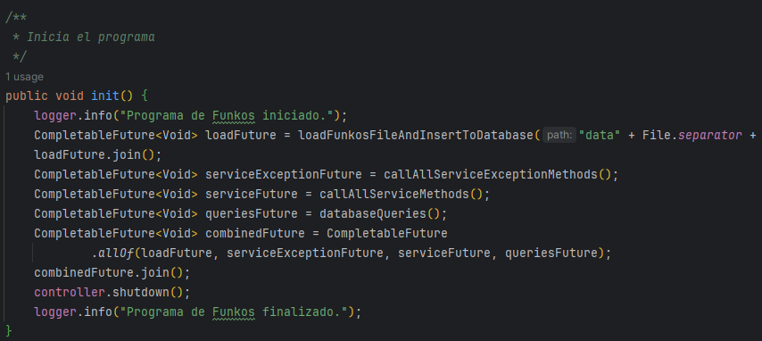

Los métodos que se llaman desde la clase principal del programa son aquellos que llaman al controlador e imprimen los datos deseados en el logger. Por ejemplo, el printFunkosGroupedByModels. Hay varios métodos que hacen uso de la API Stream para imprimir consultas adicionales a las básicas del controlador.

  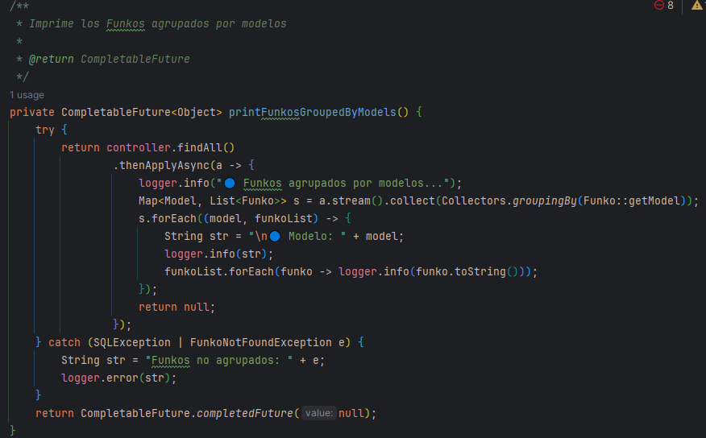

Para el Patrón Singleton, se le ha agregado la palabra "synchronized" al método getInstance. De esta forma, se evita que se puedan crear varias instancias de la base de datos. Esto es importante para evitar problemas de concurrencia.

  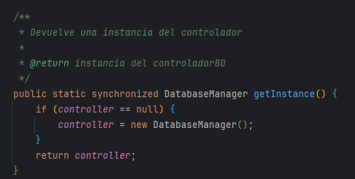

Este es el método que, dado un archivo CSV, recibe los datos y los retorna como CompletableFuture. De esta manera se cargan los datos asíncronamente.

  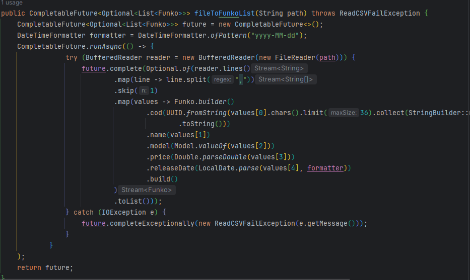

Los datos se exportan e importan utilizando GSON, también de manera asíncrona.

  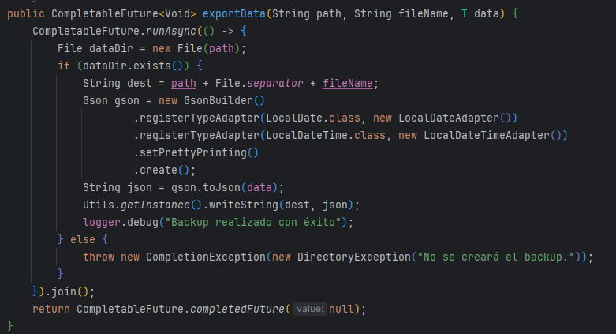

En los repositorios, servicios y controladores se ha modificado el retorno para que este devuelva CompletableFuture. De esta manera, se pueden realizar las operaciones asíncronamente.

  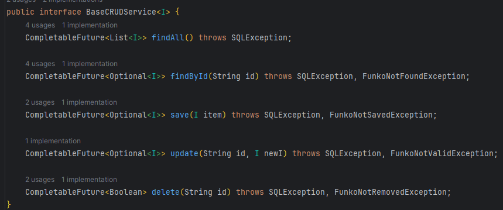

También se ha agregado un generador de ID (IdGenerator) en el paquete services. Este se encarga de asignar un ID a cada nuevo Funko que se vaya creando. De esta manera, se evita que se puedan crear dos Funkos con el mismo ID. Se utiliza un lock como bloqueador. Por defecto, los Funkos ya existentes tendrán ID asignada como -1. Los nuevos se generarán con IDs a partir de 1.

En la base de datos, a la tabla de Funkos se le ha agregado MyId un (BIGINT) que asignará la ID generada por el IdGenerator.

  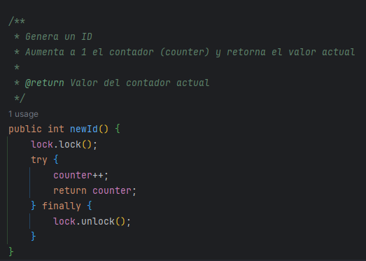

Esto es un método del servicio. Retorna un CompletableFuture. El método supplyAsync de CompletableFuture permite crear tareas asíncronas. 

En el caso de que el Funko no se encuentre en el caché, se realizará una consulta findById al repositorio. De lo contrario, se retornará un CompletableFuture de Optional de Funko.

  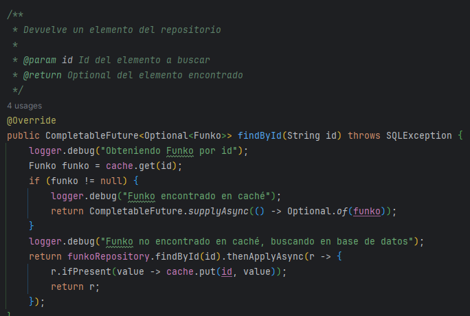

Se han creado varias interfaces y una clase para administración del Caché.

  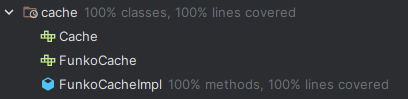

El clear elimina los Funkos pasados X segundos (la variable secondsToClear representa la cantidad de segundos). Esto se agrega al parámetro del Singleton para poder realizar mejor los Tests.

  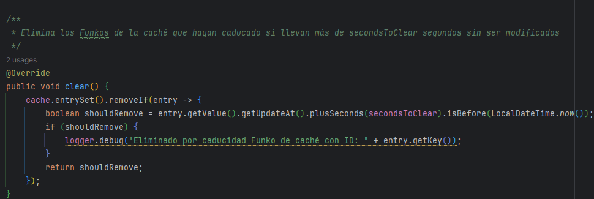

Esto es un ejemplo de un método asíncrono del repositorio. Al igual que los demás, se utiliza el método supplyAsync de CompletableFuture para volverlo asíncrono.

  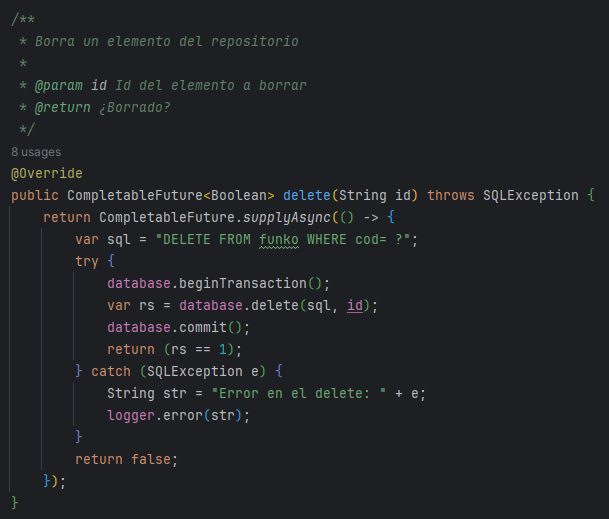

Este es un ejemplo de un método asíncrono del controlador. Primero se imprime en el logger de depuración la información actual. Después se valida el Funko (en el caso de que no sea válido, se retornará excepción) y, por último, se realiza la consulta al servicio para ser retornada.

  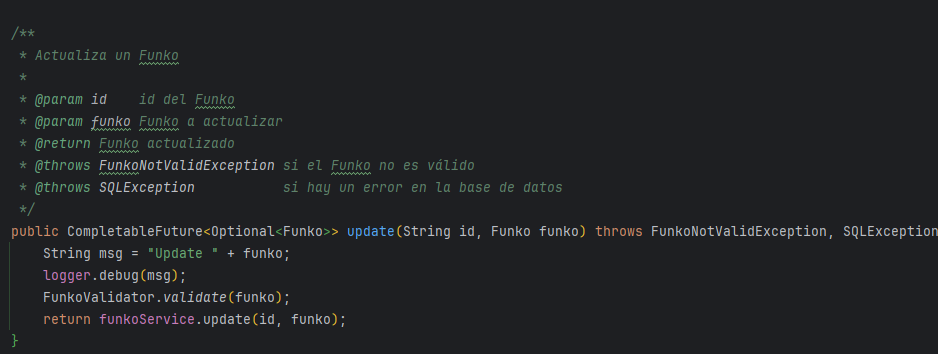

### Tests Asíncronos

Para los tests se ha utilizado Mockito y JUnit. En el ejemplo de abajo se mockea el path y el archivo para poder testear la exportación de los datos. Los datos serán exportados en backup-test.json.

  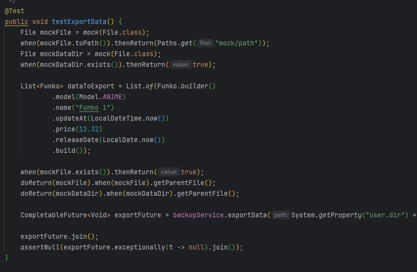

Las excepciones se comprueban con el assertThrows.

  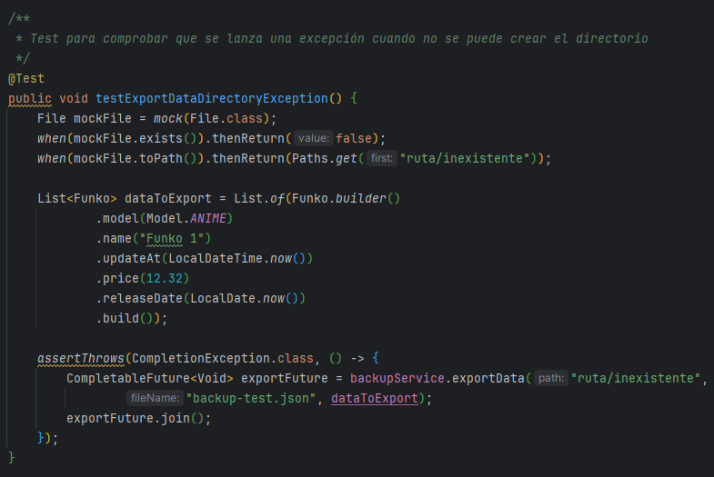

Al test de clear, por ejemplo, se le ha agregado un Thread.sleep para que se pueda comprobar que se eliminan los Funkos pasados X segundos.

  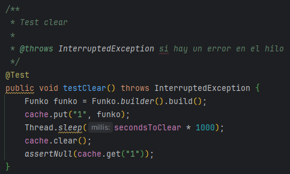

También se han testeado los repositorios asíncronos utilizando el método get() para obtener su resultado y procesarlo.

  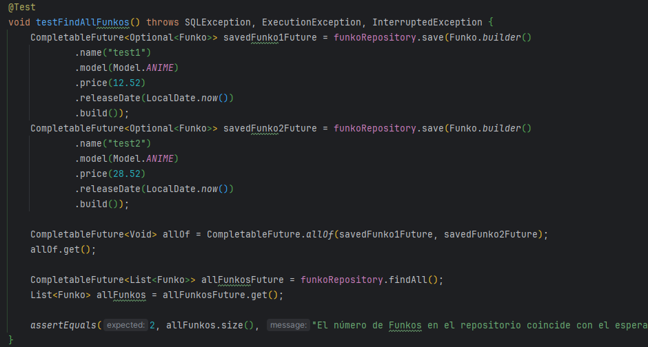

En algunos tests también se hace uso de when (Mockito) para definir el comportamiento esperado de un mock y verify para comprobar que se han llamado a los métodos correspondientes la cantidad de veces deseada.

  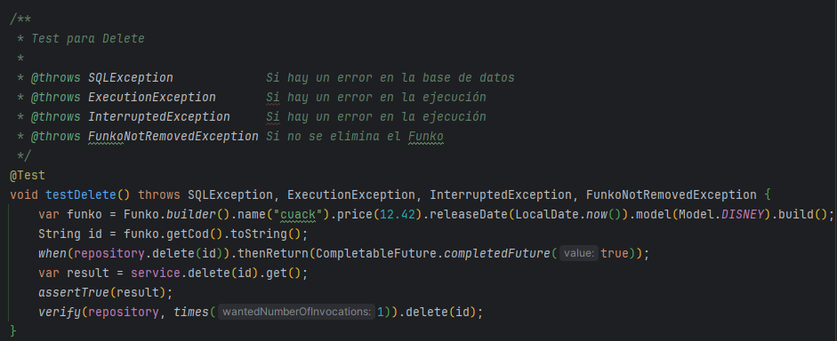

## ⚙ Herramientas
- Java 17.
- Gradle.
- H2.
- JUnit.
- Mockito.
- DotEnv.
- Lombok.
- Logback.
- Gson.
- Mybatis.

## 🗂️ Organización
- Controllers: Se encargan de recibir las peticiones del usuario y devolver la respuesta correspondiente.
- Exceptions: Se encargan de definir las excepciones que se van a utilizar en la aplicación.
- Models: Se encargan de definir los objetos que se van a utilizar en la aplicación.
- Repositories: Se encargan de realizar las operaciones con la base de datos.
- Services: Se encargan de realizar las operaciones necesarias para que el controlador pueda devolver la respuesta.
- Utils: Se encargan de definir las clases útiles que se van a utilizar en la aplicación.
- Validators: Se encargan de validar los objetos que se van a utilizar en la aplicación.
- FunkoProgram: El programa que ejecutará todas las consultas necesarias para probar el funcionamiento de la aplicación.
- Main: El programa que ejecutará la aplicación.

## 📊 Consultas API Stream
Las consultas se realizan en la clase FunkoProgram. Cada consulta interacciona con la base de datos y devuelve el resultado de la consulta. Se prueban tanto los casos incorrectos como los incorrectos.
- Funko más caro.
- Media de precio de Funkos.
- Funkos agrupados por modelos.
- Número de Funkos por modelos.
- Funkos que han sido lanzados en 2023.
- Número de Funkos de Stitch.
- Listado de Funkos de Stitch.

## 🛠️ Utils
El paquete Utils incluye las siguientes utilidades:
- ApplicationProperties: Se encarga de leer el archivo properties y devolver los valores de las propiedades.
- LocalDateAdapter: Se encarga de convertir un LocalDate a un String y viceversa.
- LocalDateTimeAdapter: Se encarga de convertir un LocalDateTime a un String y viceversa.
- Utils: Se encarga de definir métodos útiles para la aplicación.
- UuidAdapter: Se encarga de convertir un UUID a un String y viceversa.

## 🔄 Services
Incluye tres paquetes:
- CRUD: Base del CRUD y Operaciones CRUD de FUNKOS.
- Database: Se almacena el Manager de la base de datos.
- IO: Se almacena la clase CsvManager para leer un archivo CSV.

## ⚠️ Exceptions
El programa incluye las siguientes excepciones personalizadas:
- FunkoException: Excepción base de la aplicación.
- CreateFolderException: Exception que se lanza cuando no se puede crear una carpeta.
- FunkoNotFoundException: Exception que se lanza cuando no se encuentra un Funko.
- FunkoNotSavedException: Exception que se lanza cuando no se puede guardar un Funko.
- FunkoNotValidException: Exception que se lanza cuando un Funko no es válido.
- ReadCSVFailException: Exception que se lanza cuando no se puede leer un archivo CSV.

## 🔍 Operaciones CRUD
- FindAll: Se encarga de devolver todos los Funkos.
- FindById: Se encarga de devolver un Funko por su id.
- FindByName: Se encarga de devolver un Funko por su nombre.
- Save: Se encarga de guardar un Funko.
- Update: Se encarga de actualizar un Funko.
- Delete: Se encarga de eliminar un Funko.
- Backup: Se encarga de realizar un backup de la base de datos.

## Ejecución

  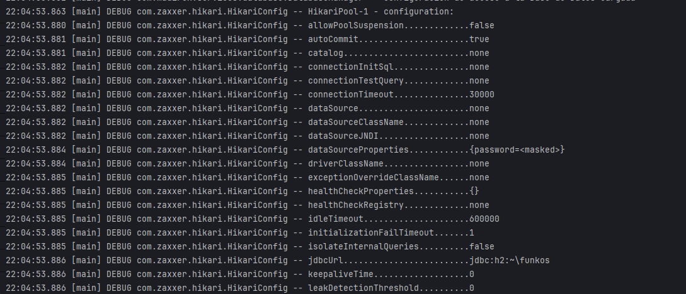

